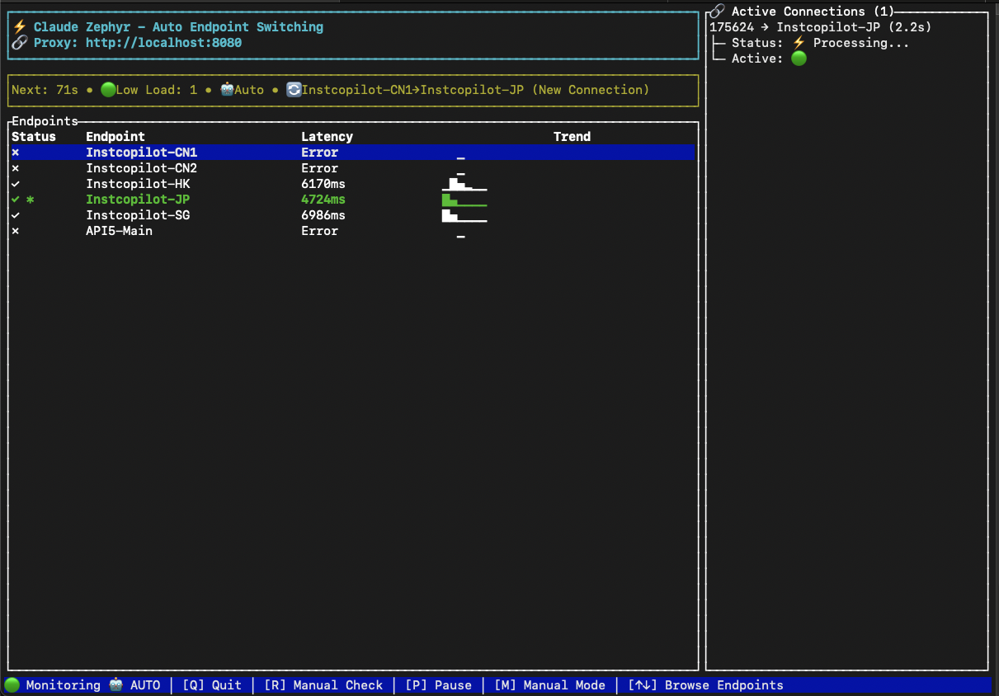

# Claude Zephyr

[中文](README.zh.md) | English

Solve Claude API endpoint instability issues. Automatically detect and switch to the fastest available endpoint.

---

---

## 🚀 Quick Start with Instcopilot

> 💰 **Recommended**: [Instcopilot](https://instcopilot-api.com/register?aff=sl67) | Invitation code: `sl67` | Get rewards for registration

**If using Instcopilot, you can use the pre-configured files directly:**

```bash
# 1. Clone the project (requires Git)
git clone https://github.com/BeaconSage/claude-zephyr.git
cd claude-zephyr

# 2. Use Instcopilot specific configuration
cp config.toml.example.instcopilot config.toml
cp .env.example.instcopilot .env

# 3. Edit .env file and fill in your Instcopilot API key
# AUTH_TOKEN_MAIN=sk-your-instcopilot-token-here

# 4. Build and start (requires Rust environment)
cargo build --release
./target/release/claude-zephyr --dashboard

# 5. Use the proxy
export ANTHROPIC_BASE_URL="http://localhost:8080"
claude -p "Hello Claude"
```

Pre-configuration includes 5 optimized nodes, ready to use out of the box.

**Prerequisites:**
- [Rust](https://rustup.rs/) build environment
- [Claude CLI](https://docs.anthropic.com/en/docs/claude-code)
- Git

---
## Problems Solved

- Claude API endpoints often timeout or respond slowly
- Manual endpoint switching is cumbersome
- Don't know which endpoint is currently fastest
- Need a stable proxy to handle these issues

## How It Works

1. **Real API Testing**: Uses `claude -p "test"` command to perform actual calls against each endpoint
2. **Latency Measurement**: Records complete response time for each endpoint (including network latency and processing time)
3. **Automatic Switching**: Selects the endpoint with lowest latency that is available
4. **Graceful Handling**: Waits for active connections to complete before switching

### Health Check Cost Analysis

Each health check uses **Claude 3.5 Haiku** model to send a simple "test" prompt, with extremely low cost:

**Single endpoint check consumption (actual log data):**
- Input tokens: ~4
- Cached tokens: ~14,815 (reusable after first creation)
- Output tokens: ~4
- Single endpoint check cost: ≈ $0.000241 USD

**5 endpoint full check cost (Instcopilot example):**
- Single full check: $0.000241 × 5 = ≈ $0.001205 USD
- Default 60-second interval: ~$0.0723 USD per hour

**Dynamic Interval Adjustment** - Automatically optimize based on connection load:
- With `dynamic_scaling = true` enabled, the system smoothly adjusts between minimum and maximum intervals
- High load: Use minimum interval (default 30 seconds) for fast detection
- Idle: Gradually extend to maximum interval (default 1 hour)
- Users can customize maximum interval via `max_interval_seconds` (supports longer durations, even overnight)

**Personal usage scenario cost comparison:**
- Working hours (8 hours): ≈ $0.58/day
- Short usage (2-3 hours): ≈ $0.22/day
- With dynamic adjustment: Long idle periods reduce to hourly checks, significantly saving overnight costs

> **Data source**: Above billing details are from actual usage logs, for reference

> **Cost Control**:  
- Users can use **[`P` pause/resume monitoring]** to manually toggle health detection, avoiding any test traffic
- System supports dynamic interval adjustment, reducing to hourly checks after 1 hour of idle time (supports overnight operation)

## Quick Start

### 1. Prerequisites
Please ensure the following tools are installed:
- **Rust** build environment: [Install Rust](https://rustup.rs/)
- **Claude CLI** tool: [Install Claude CLI](https://docs.anthropic.com/en/docs/claude-code)
- **Git**: For cloning the project code

### 2. Download and Configuration
```bash
# Clone the project
git clone https://github.com/BeaconSage/claude-zephyr.git
cd claude-zephyr

# Copy configuration file templates
cp config.toml.example config.toml
cp .env.example .env
```

Edit the `.env` file and fill in your authentication tokens:
```
AUTH_TOKEN_MAIN=your-claude-auth-token-here
AUTH_TOKEN_BACKUP=another-auth-token-if-needed
```

### 3. Start Service
```bash
# Build the project
cargo build --release

# Dashboard mode (recommended) - Real-time monitoring interface
./target/release/claude-zephyr --dashboard

# Command line mode (background running, view logs)
./target/release/claude-zephyr
```

### 4. Use Proxy
Set environment variable to let Claude CLI use the proxy:
```bash
export ANTHROPIC_BASE_URL="http://localhost:8080"
claude -p "Hello Claude"
```

## Usage

### Dashboard Mode (Recommended)
Real-time graphical monitoring interface:
- View all endpoint status and latency
- Manually select specific endpoints (↑↓ keys to move, Enter to confirm)
- Monitor active connection status
- Switch between auto/manual mode (press M key)

### Command Line Mode
Background operation, view status through logs:
- Automatically detect endpoint health status
- Automatically switch to fastest available endpoint
- Show detailed switching logs

## Configuration

### Basic Configuration
Only need to configure two files:

**config.toml** - Endpoints and server settings:
```toml
[server]
port = 8080

[[groups]]
name = "primary-provider"
auth_token_env = "AUTH_TOKEN_MAIN"
default = true
endpoints = [
    { url = "https://api.provider-a.com", name = "Provider-A-1" },
    { url = "https://api2.provider-a.com", name = "Provider-A-2" }
]
```

**.env** - Authentication tokens:
```
AUTH_TOKEN_MAIN=sk-your-auth-token-here
```

### Advanced Options
- `switch_threshold_ms`: Minimum latency improvement to trigger endpoint switch (default 50ms)
- `dynamic_scaling`: Automatically adjust check frequency based on load (default false)
- `min_interval_seconds`: Minimum interval for dynamic adjustment (default 30 seconds)
- `max_interval_seconds`: Maximum interval for dynamic adjustment (default 1 hour)
- Support multiple endpoint groups, each using different authentication tokens

## Monitoring

### Status Page
Visit http://localhost:8080/status to view:
- Currently used endpoint
- Health status of all endpoints
- Response latency statistics
- Active connection count

### Dashboard Shortcuts
- `Q`: Quit
- `R`: Manual health check refresh
- `P`: Pause/resume monitoring
- `M`: Switch auto/manual mode
- `↑↓`: Move cursor to select endpoint
- `Enter`: Confirm endpoint selection

## FAQ

**Q: What if all endpoints show errors?**
A: Check if authentication tokens are correct, ensure Claude CLI works properly.

**Q: How to add new endpoints?**
A: Edit config.toml file, add new entries in endpoints array, restart service.

**Q: Why did it switch to a slower endpoint?**
A: The previously fast endpoint may be temporarily unavailable, system automatically switches to available endpoints.

**Q: Can I disable automatic switching?**
A: In dashboard mode, press M key to switch to manual mode, then use ↑↓+Enter to select fixed endpoint.

**Q: After pressing ESC during usage, why do connections sometimes still show as active?**
A: The system has multi-layer automatic cleanup mechanisms. ESC-interrupted connections usually clean up automatically within 15-30 seconds. If connection records persist for more than 1 minute, you can manually refresh health checks (press R key in dashboard mode) to force cleanup.

## Development

```bash
# Format code
cargo fmt

# Check code
cargo clippy

# Run tests
cargo test

# Health check timing test
./target/release/claude-zephyr --test-timing
```

## License

MIT License - See LICENSE file for details

## Contributing

Issues and feature requests are welcome. Please ensure all tests pass before submitting code.