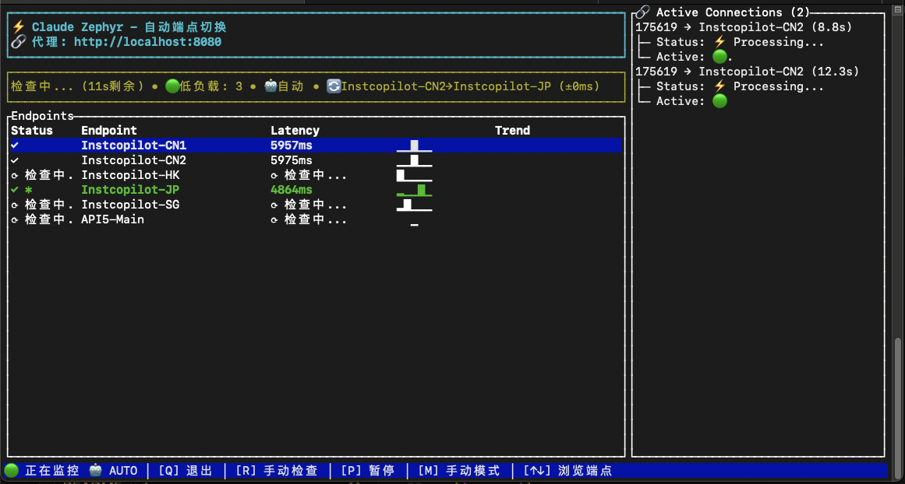

# Claude Zephyr

中文 | [English](README.md)

解决Claude API端点不稳定问题。自动检测最快可用端点并切换。
---

---

## 🚀 Instcopilot 快速开始

> 💰 **推荐**: [Instcopilot](https://instcopilot-api.com/register?aff=sl67) | 邀请码: `sl67` | 邀请注册有奖励

**如果使用 Instcopilot，可以直接使用预配置文件：**

```bash
# 1. 克隆项目（需要Git）
git clone https://github.com/BeaconSage/claude-zephyr.git
cd claude-zephyr

# 2. 使用 Instcopilot 专用配置
cp config.toml.example.instcopilot config.toml
cp .env.example.instcopilot .env

# 3. 编辑 .env 文件，填入你的 Instcopilot 密钥
# AUTH_TOKEN_MAIN=sk-your-instcopilot-token-here

# 4. 编译启动（需要Rust环境）
cargo build --release
./target/release/claude-zephyr --dashboard

# 5. 使用代理
export ANTHROPIC_BASE_URL="http://localhost:8080"
claude -p "Hello Claude"
```

预配置包含5个优化节点，开箱即用。

**前置要求：**
- [Rust](https://rustup.rs/) 编译环境
- [Claude CLI](https://docs.anthropic.com/en/docs/claude-code)
- Git

---
## 解决的问题

- Claude API端点经常超时或响应慢
- 手动切换端点很麻烦
- 不知道哪个端点当前最快
- 需要一个稳定的代理来处理这些问题

## 工作原理

1. **真实API测速**: 使用 `claude -p "test"` 命令对每个端点进行实际调用测试
2. **延迟测量**: 记录每个端点的完整响应时间（包括网络延迟和处理时间）
3. **自动切换**: 选择延迟最低且可用的端点
4. **优雅处理**: 等待活跃连接完成后再切换

### 测速成本说明

每次健康检查使用 **Claude 3.5 Haiku** 模型发送简单的"test"提示词，成本极低：

**单端点检查消耗（实际日志数据）：**
- 提示 tokens: ~4 个
- 缓存 tokens: ~14815 个（首次创建后可复用）
- 输出 tokens: ~4 个
- 单端点检查成本: ≈ $0.000241 USD

**5个端点全检查费用（以 Instcopilot 为例）：**
- 单次全检查: $0.000241 × 5 = ≈ $0.001205 USD
- 默认间隔60秒运行: 每小时 ≈ $0.0723 USD

**动态间隔调整** - 根据连接负载自动优化：
- 启用 `dynamic_scaling = true` 后，系统会在最小间隔到最大间隔之间平滑调整
- 高负载时：使用最小间隔（默认30秒）确保快速检测
- 空闲时：渐进延长至最大间隔（默认1小时）
- 用户可通过 `max_interval_seconds` 自定义最大间隔（支持更长时间，甚至过夜）

**个人使用场景成本对比：**
- 工作时间运行（8小时）: ≈ $0.58/天
- 短时间使用（2-3小时）: ≈ $0.22/天
- 启用动态调整：长时间空闲可降至每小时检查，大幅节省过夜成本

> **数据来源**: 以上计费详情来自实际使用日志记录，供参考使用

> **成本控制**:  
- 用户可以使用 **[`P` 暂停/恢复监控]** 手动开关健康检测，这样就不会有任何测试流量
- 系统支持动态间隔调整，空闲1小时后可降至每小时检查一次（支持过夜运行）

## 快速开始

### 1. 前置依赖
请确保已安装以下工具：
- **Rust** 编译环境：[安装 Rust](https://rustup.rs/)
- **Claude CLI** 工具：[安装 Claude CLI](https://docs.anthropic.com/en/docs/claude-code)
- **Git**：用于克隆项目代码

### 2. 下载和配置
```bash
# 克隆项目
git clone https://github.com/BeaconSage/claude-zephyr.git
cd claude-zephyr

# 复制配置文件模板
cp config.toml.example config.toml
cp .env.example .env
```

编辑 `.env` 文件，填入你的认证令牌：
```
AUTH_TOKEN_MAIN=your-claude-auth-token-here
AUTH_TOKEN_BACKUP=another-auth-token-if-needed
```

### 3. 启动服务
```bash
# 编译项目
cargo build --release

# 仪表板模式（推荐）- 实时监控界面
./target/release/claude-zephyr --dashboard

# 命令行模式（后台运行，查看日志）
./target/release/claude-zephyr
```

### 4. 使用代理
设置环境变量，让Claude CLI使用代理：
```bash
export ANTHROPIC_BASE_URL="http://localhost:8080"
claude -p "Hello Claude"
```

## 使用方式

### 仪表板模式（推荐）
实时图形监控界面：
- 查看所有端点状态和延迟
- 手动选择特定端点（按1-9A-Z键）
- 监控活跃连接情况
- 切换自动/手动模式（按M键）

### 命令行模式
后台运行，通过日志查看状态：
- 自动检测各端点健康状态
- 自动切换到最快的可用端点
- 显示详细的切换日志

## 配置说明

### 基本配置
只需要配置两个文件：

**config.toml** - 端点和服务器设置：
```toml
[server]
port = 8080

[[groups]]
name = "primary-provider"
auth_token_env = "AUTH_TOKEN_MAIN"
default = true
endpoints = [
    { url = "https://api.provider-a.com", name = "Provider-A-1" },
    { url = "https://api2.provider-a.com", name = "Provider-A-2" }
]
```

**.env** - 认证令牌：
```
AUTH_TOKEN_MAIN=sk-your-auth-token-here
```

### 高级选项
- `switch_threshold_ms`: 切换端点的最小延迟改善（默认50ms）
- `dynamic_scaling`: 根据负载自动调整检查频率（默认false）
- `min_interval_seconds`: 动态调整的最小间隔（默认30秒）
- `max_interval_seconds`: 动态调整的最大间隔（默认1小时）
- 支持多个端点组，每组使用不同的认证令牌

## 监控

### 状态页面
访问 http://localhost:8080/status 查看：
- 当前使用的端点
- 所有端点的健康状态
- 响应延迟统计
- 活跃连接数

### 仪表板快捷键
- `Q`: 退出
- `R`: 手动刷新健康检查
- `P`: 暂停/恢复监控
- `M`: 切换自动/手动模式
- `1-9A-Z`: 手动选择端点
- `↑↓`: 滚动连接列表

## 常见问题

**Q: 所有端点都显示错误怎么办？**
A: 检查认证令牌是否正确，确保Claude CLI能正常工作。

**Q: 如何添加新的端点？**
A: 编辑config.toml文件，在endpoints数组中添加新条目，重启服务。

**Q: 为什么切换到了更慢的端点？**
A: 可能是之前的快速端点暂时不可用，系统自动切换到可用的端点。

**Q: 可以禁用自动切换吗？**
A: 在仪表板模式下按M键切换到手动模式，然后用↑↓+Enter选择固定端点。

**Q: 使用过程中按ESC中断后，为什么有时还会显示连接中？**
A: 系统有多层自动清理机制，ESC中断的连接通常会在15-30秒内自动清理完成。如果连接记录持续存在超过1分钟，可以手动刷新健康检查（仪表板模式按R键）来强制清理。

## 开发

```bash
# 格式化代码
cargo fmt

# 检查代码
cargo clippy

# 运行测试
cargo test

# 健康检查时序测试
./target/release/claude-zephyr --test-timing
```

## 许可证

MIT License - 详见 LICENSE 文件

## 贡献

欢迎提交问题报告和功能请求。提交代码前请确保通过所有测试。